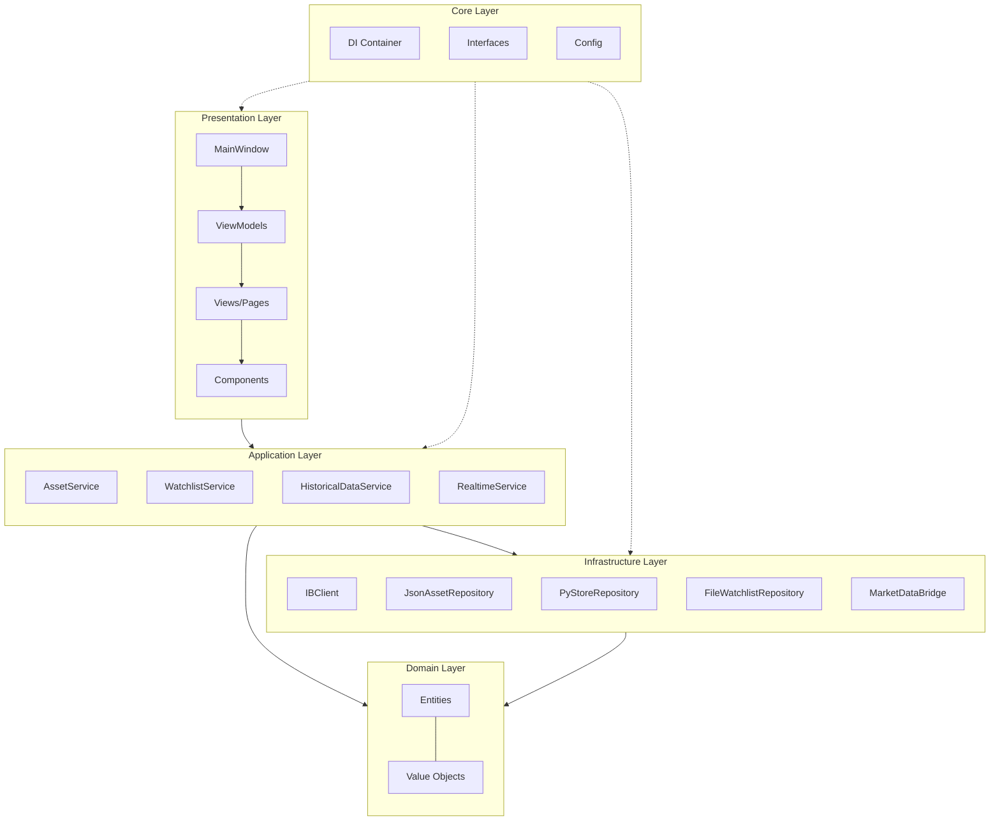
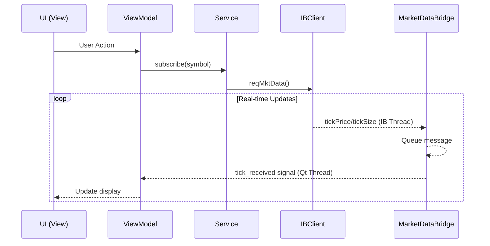

# FinanceApp

A PyQt6 desktop application for financial trading with real-time market data from Interactive Brokers. Built using Clean Architecture principles with MVVM pattern for the presentation layer.

## Run

### Prerequisites

- Python 3.10 - 3.12
- [uv](https://docs.astral.sh/uv/) package manager
- Interactive Brokers TWS or IB Gateway running

### Quick Start

```bash
# Clone the repository
git clone https://github.com/lukaskellerstein/FinanceApp.git
cd FinanceApp

# Create virtual environment and install dependencies
uv venv
source .venv/bin/activate  # On Linux/macOS
# or .venv\Scripts\activate  # On Windows

uv sync

# Run the applicationV
python main.py
```

### Command Line Options

```bash
python main.py [OPTIONS]

Options:
  --port PORT       Control server port (auto-detect if not specified)
  --host HOST       Control server host (default: localhost)
  --client-id ID    IB client ID (auto-detect if not specified)
  --workspace ID    Workspace ID for window title (MCP multi-instance support)
  --no-server       Disable MCP control server
  --no-ib           Don't connect to Interactive Brokers
```

### Configuration

Edit `config.ini` to configure IB connection:

```ini
[APP_SETTINGS]
environment=dev

[IB]
tws_ip=127.0.0.1
tws_real_port=7496
tws_sim_port=7497

[DB]
hist_data_path=./db/hist_data
```

---

## Architecture

The application follows **Clean Architecture** principles with clear separation of concerns across layers:



### Layer Responsibilities

| Layer | Purpose |
|-------|---------|
| **Presentation** | PyQt6 UI components, MVVM pattern, user interactions |
| **Application** | Business logic, orchestration, use cases |
| **Domain** | Core entities, value objects, business rules |
| **Infrastructure** | External integrations (IB, persistence, threading) |
| **Core** | Cross-cutting concerns (DI, interfaces, config) |

### Data Flow



---

## Project Structure

```
FinanceApp/
├── main.py                     # Application entry point
├── config.ini                  # Configuration file
├── pyproject.toml              # Project dependencies
├── db/                         # Data storage
│   ├── assets/                 # Asset JSON files (stocks/, futures/)
│   ├── watchlists/             # Watchlist JSON files
│   └── hist_data/              # PyStore historical data
├── docs/                       # Documentation
│   ├── testability_via_mcp.md  # MCP testing guide
│   └── testability_via_regolith.md  # Multi-instance workspace management
├── lib/
│   └── ibapi/                  # Interactive Brokers API (local editable)
├── mcp_server/                 # MCP server for Claude Code testing
│   └── pyqt_mcp.py
└── src/
    ├── core/                   # Cross-cutting concerns
    ├── domain/                 # Business entities
    ├── infrastructure/         # External integrations
    ├── application/            # Business services
    └── presentation/           # UI layer
```

### Source Directory Details

#### `src/core/` - Core Layer

Cross-cutting concerns shared across all layers.

| Directory | Contents |
|-----------|----------|
| `config/` | `AppConfig` - Configuration management from `config.ini` |
| `di/` | `DIContainer` - Lightweight dependency injection container |
| `interfaces/` | Abstract interfaces (`IBrokerClient`, `IAssetRepository`, etc.) |
| `exceptions/` | Custom exception classes |
| `threading/` | Thread management utilities |

#### `src/domain/` - Domain Layer

Core business entities and value objects (no external dependencies).

| Directory | Contents |
|-----------|----------|
| `entities/` | `Asset`, `Contract`, `ContractDetails`, `Watchlist`, `Timeframe` |
| `value_objects/` | `TickData`, `BarData` - Immutable data structures |

#### `src/infrastructure/` - Infrastructure Layer

External system integrations and implementations.

| Directory | Contents |
|-----------|----------|
| `broker/` | `IBClient` - Interactive Brokers integration, `IBState` - Request tracking, `IBMappers` - Type conversions |
| `persistence/json/` | `JsonAssetRepository` - Asset storage in JSON files |
| `persistence/pystore/` | `PyStoreHistoricalRepository` - Historical data in Parquet format |
| `persistence/file/` | `FileWatchlistRepository` - Watchlist storage |
| `control_server.py` | MCP control server for testability |

#### `src/application/` - Application Layer

Business logic and service orchestration.

| Directory | Contents |
|-----------|----------|
| `services/` | `AssetService`, `WatchlistService`, `HistoricalDataService`, `RealtimeService` |
| `tasks/` | Background tasks (data downloads) |
| `helpers/` | Utility functions |
| `bootstrap.py` | Application initialization and DI configuration |

#### `src/presentation/` - Presentation Layer

PyQt6 UI implementation using MVVM pattern.

| Directory | Contents |
|-----------|----------|
| `core/` | `BaseView`, `BaseWindow`, `BaseViewModel` - Base classes |
| `viewmodels/` | `StocksWatchlistViewModel`, `FuturesWatchlistViewModel` |
| `views/` | Reusable view components |
| `windows/` | `MainWindow`, `AssetDetailWindow` |
| `windows/asset_detail/pages/` | Detail pages (charts, tables, fundamentals) |
| `components/` | Reusable UI components |
| `components/charts/` | `CandlestickChart`, `MultiCandlestickChart` |
| `components/tables/` | `HistoricalDataTable` |
| `models/` | Qt models (`FuturesTreeModel`, `FuturesTreeItem`) |
| `state/` | `MarketDataBridge` - Thread-safe IB to Qt communication |

---

## Features

- **Real-time Market Data**: Live bid/ask, last price, volume from Interactive Brokers
- **Watchlists**: Multiple watchlists for stocks and futures with real-time updates
- **Asset Management**: Add, view, and delete assets with automatic IB contract lookup
- **Historical Data**: Download and store OHLCV data using PyStore (Parquet format)
- **Charts**: Interactive candlestick charts with volume
- **Futures Support**: Hierarchical tree view showing futures with all contract months
- **Market Status**: Real-time market open/close countdown (US Eastern Time)

---

## Technologies & Libraries

### Core Framework

| Library | Version | Purpose |
|---------|---------|---------|
| **PyQt6** | >= 6.6.0 | GUI framework |
| **pyqtgraph** | >= 0.13.7 | Fast plotting for charts |

### Data Processing

| Library | Version | Purpose |
|---------|---------|---------|
| **pandas** | >= 2.2.0 | DataFrame operations |
| **numpy** | >= 2.0.0 | Numerical computations |
| **pyarrow** | >= 18.0.0 | Parquet file support |
| **dask** | >= 2025.1.0 | Large dataset handling |

### Storage

| Library | Version | Purpose |
|---------|---------|---------|
| **pystore** | >= 0.1.22 | Time-series data storage (Parquet-based) |

### Financial

| Library | Version | Purpose |
|---------|---------|---------|
| **ibapi** | local | Interactive Brokers API |
| **QuantLib** | >= 1.40 | Quantitative finance calculations |
| **exchange-calendars** | >= 4.11.0 | Market calendar data |
| **holidays** | >= 0.85 | Holiday calendar support |

### Reactive/Async

| Library | Version | Purpose |
|---------|---------|---------|
| **rx** | >= 3.2.0 | Reactive extensions (legacy support) |

### Visualization

| Library | Version | Purpose |
|---------|---------|---------|
| **matplotlib** | >= 3.10.0 | Additional charting capabilities |

### Testing & Development

| Library | Version | Purpose |
|---------|---------|---------|
| **mcp[cli]** | >= 1.3.0 | Model Context Protocol for AI testing |
| **pytest** | >= 8.0.0 | Testing framework |
| **black** | >= 25.0.0 | Code formatting |
| **flake8** | >= 7.0.0 | Linting |
| **pylint** | >= 4.0.0 | Static analysis |

---

## MCP Testability

The application includes an MCP (Model Context Protocol) control server that enables Claude Code to programmatically control and test the application.

### Available MCP Tools

| Tool | Description |
|------|-------------|
| `launch_app` | Start the application on a dedicated workspace |
| `close_app` | Close the application |
| `get_snapshot` | Get all UI widgets and their states |
| `click` | Click a button or widget |
| `fill` | Enter text into an input field |
| `get_text` | Read text from a widget |
| `select_combo` | Select a combo box value |
| `select_tab` | Select a tab |
| `get_table_data` | Get data from a table widget |
| `trigger_action` | Trigger a menu action |

### Documentation

- [MCP Testing Guide](docs/testability_via_mcp.md) - How to make PyQt apps testable via MCP
- [Regolith Workspace Management](docs/testability_via_regolith.md) - Multi-instance support with i3wm

---

## Design Patterns

### MVVM (Model-View-ViewModel)

```
View (QWidget) ←→ ViewModel (QObject) ←→ Model (Services)
     ↓                    ↓
  UI Events          Qt Signals
     ↓                    ↓
Commands/Actions    Property Changes
```

- **View**: PyQt6 widgets, handles display and user input
- **ViewModel**: Business logic, exposes data via Qt signals
- **Model**: Application services, domain entities

### Dependency Injection

The `DIContainer` supports:
- **Singleton**: One instance for entire app lifetime
- **Transient**: New instance on each resolve
- **Scoped**: One instance per scope/child container
- **Factory functions**: Custom instance creation

```python
container = DIContainer()
container.register_singleton(IAssetRepository, factory=lambda c: JsonAssetRepository(path))
container.register_singleton(IAssetService, factory=lambda c: AssetService(
    c.resolve(IAssetRepository),
    c.resolve(IBrokerClient)
))

# Usage
service = container.resolve(IAssetService)
```

### Thread-Safe Market Data Bridge

The `MarketDataBridge` safely transfers data from IB's network thread to Qt's main thread:

```python
# IB Thread (called by ibapi)
bridge.enqueue_tick(symbol, field, value)

# Qt Main Thread (processes queue every 10ms)
bridge.tick_received.connect(viewmodel.on_tick)
```

---

## License

MIT License
